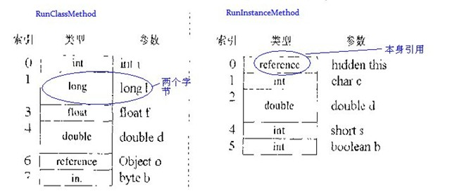
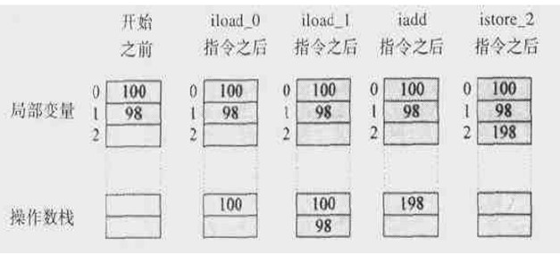
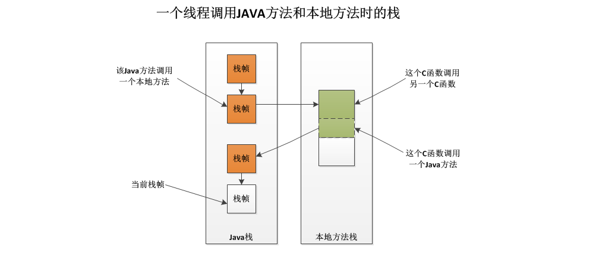
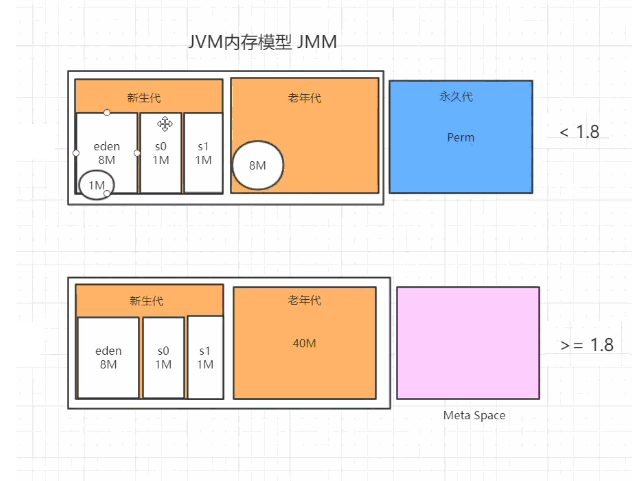
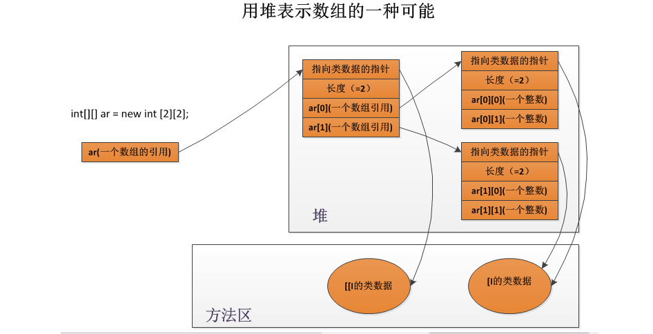

## 结构 ##
  

## 逻辑 ##
  

## 1. 虚拟机栈 ##
### 结构 ###
  

- **局部变量表**:  
	1. 局部变量区被组织为以一个字(32位，不同于字节的描述)长为单位、从0开始计数的数组，类型为short、byte和char的值在存入数组前要被转换成int值，而long和double在数组中占据连续的两项，在访问局部变量中的long或double时，只需取出连续两项的第一项的索引值即可,如某个long值在局部变量区中占据的索引时3、4项，取值时，指令只需取索引为3的long值即可。  
  
	2. runInstanceMethod的局部变量区第一项是个reference（引用），它指定的就是对象本身的引用，也就是我们常用的this, 静态方法栈帧中没有该引用。  

		 	public static int runClassMethod(int i,long l,float f,double d,Object o,byte b) {   
		 		return 0;   
		 	}   
		 	
		 	public int runInstanceMethod(char c,double d,short s,boolean b) {   
		 		return 0;   
		 	}  
	3. 从方法参数开始，按顺序排列。
- **操作数栈**:  
	1. 和局部变量区一样，操作数栈也被组织成一个以1字长为单位的数组。但和前者不同的是，它不是通过索引来访问的，而是通过入栈和出栈来访问的。
	2. 可把操作数栈理解为存储计算时，**临时数据的存储区域**。  
	  

- **帧数据区**: 
	1. 帧还需要一些数据来支持常量池解析、正常方法返回以及异常派发机制。这些数据都保存在java栈帧的帧数据区中。
	2. 当JVM执行到需要常量池数据的指令时，它都会通过帧数据区中指向常量池的指针来访问它。
	3. 如果是通过return正常结束，则当前栈帧从Java栈中弹出，恢复发起调用的方法的栈。如果方法有返回值，JVM会把返回值压入到发起调用方法的操作数栈。
	4. 当异常抛出时，如果异常没有捕获, 则方法立即终止，然后JVM用帧区数据的信息恢复发起调用的方法的帧。然后再发起调用方法的上下文重新抛出同样的异常。(因此异常时可以输出栈的调用信息，因为是一层一层往上抛异常。)  
	5. 帧中存储了对应方法的局部数据，方法执行完，对应的帧则从栈中弹出，并把返回结果存储在**调用方法**的帧的操作数栈中  

- **动态链接**:  
	- 实际上就是地址的一个别名,方便开发人员和计算机去识别到对应的数据。
	- 就相当于我在0X0300H这个地址存入了一个数526，为了方便编程，我把这个给这个地址起了个别名叫A, 以后我编程的时候(运行之前)可以用别名A来暗示访问这个空间的数据，但其实程序运行起来后，实质上还是去寻找0X0300H这片空间来获取526这个数据的。**这样的"符号引用"和直接引用在运行时进行解析和链接的过程**，叫动态链接。

## 2. 本地方法栈 ##
  

- 如果某个虚拟机实现的本地方法接口是使用C连接模型的话，那么它的本地方法栈就是C栈。
- 当它调用的是本地方法时，虚拟机会保持Java栈不变，不再在线程的Java栈中压入新的帧，虚拟机只是简单地动态连接并直接调用指定的本地方法。

## 3. 程序计数器 ##
1. 程序计数器是用于存放下一条指令所在单元的地址的地方。  
2. 主要是针对线程而言, 每一条线程都有自己的PC寄存器, 也就是程序计数器。线程启动时创建，大小为1个字长，持有一个本地指针，以及一个returnAddress。  
3. 当执行到某一条方法时，PC寄存器的内容总是下一条将被执行指令的地址。可以是本地指针，也可以是方法字节码对于该方法起始指令的偏移量。  
4. 如果该线程正在执行一个本地方法，此时PC寄存器的值为"undefined"。  

## 4. 方法区 ##
  

1. **类型信息**  	
	- 类型的全限定名
	- 超类的全限定名
	- 直接超接口的全限定名
	- 类型标志（该类是类类型还是接口类型）
	- 类的访问描述符（public、private、default、abstract、final、static）
2. **类型的常量池**  
	-  存放该类型所用到的常量的有序集合，包括直接常量（如字符串、整数、浮点数的常量）和对其他类型、字段、方法的符号引用。常量池中每一个保存的常量都有一个索引，就像数组中的字段一样。因为常量池中保存中所有类型使用到的类型、字段、方法的字符引用，所以它也是动态连接的主要对象（在动态链接中起到核心作用）。
3. **字段信息**（该类声明的所有字段）
	- 字段修饰符（public、protect、private、default）
	- 字段的类型
	- 字段名称
4. **方法信息**
	- 方法修饰符
	- 方法返回类型
	- 方法名
	- 方法参数个数、类型、顺序等
	- 方法字节码
	- 操作数栈和该方法在栈帧中的局部变量区大小
	- 异常表
5. **类变量**（静态变量）  
	指该类所有对象共享的变量，即使没有任何实例对象时，也可以访问的类变量。它们与类进行绑定。
6. **指向类加载器的引用**  
	每一个被JVM加载的类型，都保存这个类加载器的引用，类加载器动态链接时会用到。
7. **指向Class实例的引用**  
	类加载的过程中，虚拟机会创建该类型的Class实例，方法区中必须保存对该对象的引用。通过Class.forName(String className)来查找获得该实例的引用，然后创建该类的对象。
8. **方法表**  
	为了提高访问效率，JVM可能会对每个装载的非抽象类，都创建一个数组，数组的每个元素是实例可能调用的方法的直接引用，包括父类中继承过来的方法。这个表在抽象类或者接口中是没有的，类似C++虚函数表vtbl。
9. **运行时常量池**(Runtime Constant Pool)  
	- 用于存放编译器生成的各种**字面常量**和**符号引用**，这部分内容被类加载后进入方法区的运行时常量池中存放。
	- 运行时常量池相对于Class文件常量池的另外一个特征具有动态性，可以在**运行期间将新的常量放入池中**（典型的如String类的intern()方法）。
	- 实际上Constant Pool翻译成常量池是不合适的，实际上应该翻译成“符号引用”。

## 5. 堆 ##
  

> 一个JAVA虚拟机实例中只存在一个堆空间，因此所有线程都将共享这个堆。又由于一个Java程序独占一个JAVA虚拟机实例，因而每个Java程序都有它自己的堆空间——它们不会彼此干扰。但是同一个Java程序的多个线程却共享着同一个堆空间，在这种情况下，就得考虑多线程访问对象（堆数据）的同步问题了。  

### **对象分配规则** ###
- **优先分配Eden**  

  >对象优先分配在Eden区，如果Eden区没有足够的空间时，虚拟机执行一次Minor GC。
- **大对象直接进入老年代（需要大量连续内存空间的对象）**  

    >这样做的目的是避免在Eden区和两个Survivor区之间发生大量的内存拷贝（**新生代采用复制算法收集内存**）。
- **长期存活的对象进入老年代**  

    >虚拟机为每个对象定义了一个年龄计数器，如果对象经过了1次Minor GC那么对象会进入Survivor区，之后每经过一次Minor GC那么对象的年龄加1，直到达到阀值对象进入老年区。
- **动态判断对象的年龄**  

    >如果Survivor区中相同年龄的所有对象大小的总和大于Survivor空间的一半，年龄大于或等于该年龄的对象可以直接进入老年代。  
- **空间分配担保**  

    >**每次进行Minor GC时，JVM会计算Survivor区移至老年区的对象的大小，如果这个值大于老年区的剩余值大小则进行一次Full GC，如果小于检查HandlePromotionFailure设置，如果true则只进行Monitor GC,如果false则进行Full GC**。  

----------

### **堆数据关系** ###

   

- 数组类的名称由两部分组成：每一维用一个方括号“[”表示，用字符或字符串表示元素类型。比如，元素类型为int整数的、一维数组的类名为“[I”，元素类型为byte的三维数组为“[[[B”，元素类型为Object的二维数组为“[[Ljava/lang/Object”。  
- 在堆中的每个数组对象还必须保存的数据时数组的长度、数组数据，以及某些指向数组的类数据的引用。虚拟机必须能够通过一个数组对象的引用得到此数组的长度，通过索引访问其元素（期间要检查数组边界是否越界），调用所有数组的直接超类Object声明的方法等等。

